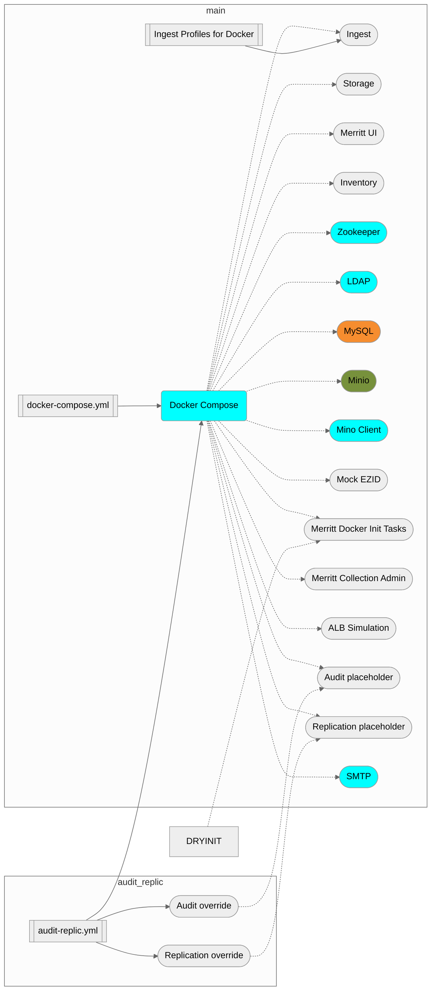

Merritt Docker Images and Orchestration
=======================================


This library is part of the [Merritt Preservation System](https://github.com/CDLUC3/mrt-doc).

The purpose of this repository is to build docker images for local developer
testing of the [Merritt system](https://github.com/cdluc3/mrt-doc/wiki).

## Quick Start Guide

### Prerequisites

#### UC3 Docker Dev Server
- You must me a member of group `docker`.
- You must deploy this repository on a merritt docker host under directory
  `/dpr2/merritt-workspace`.

#### Local Workstation
- M2 Macbook Pro (16G RAM) or equivalent
- Docker Desktop installed

### Installation

#### UC3 Docker Dev Server
Log into one of our uc3-mrt-docker-dev hosts.  Run the following commands as normal user.

1. Ensure user writable directory from which to do initial cloning:
   ```
   cd /dpr2/merritt-workspace
   mkdir $USER
   cd $USER
   ```

1. Clone merritt-docker repo and pull in submodules:
   ```
   BRANCH=main
   git clone git@github.com:CDLUC3/merritt-docker.git -b $BRANCH \
	--remote-submodules --recurse-submodules
   ```

1. Set up docker environment vars:
   ```
   merritt-docker> source bin/docker_environment.sh
   ```

1. Build dependencies:
   ```
   cd merritt-docker
   bin/dep_build.sh
   bin/it_build.sh
   ```

#### Local Workstation

1. Clone merritt-docker repo and pull in submodules:
   ```
   BRANCH=main
   git clone git@github.com:CDLUC3/merritt-docker.git -b $BRANCH \
	--remote-submodules --recurse-submodules
   ```

1. Set up local variables
   ```
   export ECR_REGISTRY=it-docker-registry
   ```

1. Allow Minio container to resolve local pre-signed URL's
   ```
   sudo echo '127.0.0.1	my-minio-localhost-alias' >> /etc/hosts
   ```

1. Build dependencies:
   ```
   cd merritt-docker
   bin/local_dep_build.sh
   bin/local_it_build.sh
   ```

### Usage

1. Ensure all submodule code is up-to-date with respective remotes:
   ```
   merritt-docker> git submodule update --remote
   ```

1. Build docker images for micro-services
   ```
   merritt-docker> cd mrt-services
   mrt-services> docker-compose build --pull
   ```

1. Run core merritt services:
   ```
   mrt-services> docker-compose -p merritt up -d
   mrt-services> docker-compose -p merritt down
   ```

1. Connect to service menu on your merritt-docker host:
   http://_my-docker-host_:8086/docker.html

For more detailed usage instructions see [Running Merritt Docker](#running-merritt-docker) below.


---


## Component Overview

### The Merritt Stack

Custom built docker images are staged in our AWS [Elastic Container
Registry](#elastic-container-registry) instance.  This is notated below as ${ECR}.

The [mrt-services/docker.html](mrt-services/docker.html) is served by the UI
and it provides access to individual containers.


| Component        | Image Name                      | Notes |
| -----------      | ----------                      | ----- |
| Zookeeper        | zookeeper                       |       |
| OpenDJ           | ldap                            |       |
| MySQL            | ${ECR}/mrt-database             |       |
| UI               | ${ECR}/mrt-dashboard            |       |
| Ingest           | ${ECR}/mrt-ingest               |       |
| Storage          | ${ECR}/mrt-storage              |       |
| Inventory        | ${ECR}/mrt-inventory            |       |
| Audit            | ${ECR}/mrt-audit                |       |
| Replic           | ${ECR}/mrt-audit                |       |
| Merritt Init     | ${ECR}/mrt-init                 | Init inventory services.|
| Minio            | minio/minio                     | Containerized storage service - for testing presigned functionality |
| Minio Cmd        | minio/mc                        | Initialized bucket in Minio container |

### Lambda Testing Stack

| Component        | Image Name                      | Notes |
| -----------      | ----------                      | ----- |
| ALB Simulator    | ${ECR}/simulate-lambda-alb      | Simulates an ALB running in front of a Lambda for Collection Admin |
| Collection Admin | ${ECR}/uc3-mrt-colladmin-lambda | Merritt collection admin tool |

### Optional OpenSearch Stack

see [Using OpenSearch with Merritt Services](docs/using_opensearch.md)

| Component            | Image Name            | Notes |
| -----------          | ----------            | ----- |
| OpenSearch           | opensearchproject/opensearch            | |
| OpenSearch Dashboard | opensearchproject/opensearch-dashboards | |
| Logstash             | opensearchproject/logstash-oss          | |


### Merritt Integration Test Driver

https://github.com/CDLUC3/mrt-integ-tests


### Diagram



---

## UC3 Merritt Docker Hosts

UC3 maintains a set of EC2 docker hosts for development use.  These provide all
the necessary [Docker Dependencies](#docker-dependencies) and compute resources
to run the full fleet of docker containers comprising
[The Merritt Stack](#the-merritt-stack).

For a listing of available merritt docker hosts see
[UC3 Service Inventory](https://uc3-service-inventory.cdlib.org/index.html?table_name=host&column=fqsn&item=uc3-mrt-docker-dev)

The IAS team has provisioned the merritt docker hosts to allow us to run
docker commands without root privileges and to limit access by code running in
containers to system resources on the Docker host.

- UC3 developers are members of group `docker.`
- Docker storage lives under `/dpr2/merritt-workspace.`
- UIDs/GIDs are remapped to prevent container users gaining access
  to privileged resources on Docker hosts.  See:
  [Docker User Namespace Mapping](docs/docker_user_namespace_mapping.md) for more info.
- IP addresses for containers are drawn from a custom cidr block to prevent
  overlap with real IPs in the CDL network ("10.10.0.0/16).
- Containers which expose network ports are limited to a set of allowed
  ports (8080:8099).  If we need more ports, we can ask IAS to expand this set.

  **Current Port Usage**
  | Port | Category | Purpose |
  | ---- | -------- | ------- |
  | 8080 | Dev Stack| Ingest|
  | 8080 | IntTest Stack| Integration Test: service-it tomcat port|
  | 8081 | Dev Stack| Store|
  | 8082 | Dev Stack| Inventory|
  | 8086 | Dev Stack| UI|
  | 8088 | Dev Stack| Minio API|
  | 8089 | `***` | CDL Reserved, do not use|
  | 8090 | Lambda Stack| Lambda Container, Collection Admin|
  | 8091 | Lambda Stack| ALB Simulator in front of Lambda Container|
  | 8092 | Dev Stack| Replic|
  | 8093 | Dev Stack| Audit|
  | 8094 | OpenSearch Stack| OpenSearch Dashboards|
  | 8095 | Dev Stack| Minio Web Console|
  | 8096 | IntTest Stack| Integration Test: Mock Merritt Service|
  | 8097 | Content Stack| Pal Museum data ingest service|
  | 8098 | IntTest Stack| Integration Test: Minio admin port|
  | 8098 | Dev Stack| Ingest Callback |
  | 8099 | IntTest Stack| Integration Test: service-it debug|

## Project Internals


### Repository Layout

```
merritt-docker/
├── bin			# helper scripts 
├── docs
├── mrt-integ-tests	# submodule path for running Merritt integrity checks
├── mrt-services	# docker-compose scripts and submodule paths for 
|                         dependencies and micro-services
└── README.md
```


### Docker Dependencies

The following dependencies are needed to build and run this repo.  The goal is
to build a version of the system that can be run entirely from Docker.  If you
are running on one of the `uc3-mrt-docker-dev` hosts, these dependencies are
already in place.  In fact, it's probably a waste of effort to try to set 
all this up elsewhere.

- Docker and Docker Compose install
- Access to the CDL maven repo for a couple of pre-built jars
  - TODO: build these from source in the Dockerfile
- CDL LDAP access
- A local maven repo build of mrt-conf jar files
- Access to storage services
- Access to config properties
  - SSM ParameterStore


### Elastic Container Registry

Most docker-compose scripts in this project rely on AWS Elastic Container
Registry (ECR) for publishing and loading custom docker images.  To 
make use of ECR you must set up the following shell enviromnent vars:
```
export AWS_ACCOUNT_ID=`aws sts get-caller-identity| jq -r .Account`
export AWS_REGION=us-west-2
export ECR_REGISTRY=${AWS_ACCOUNT_ID}.dkr.ecr.${AWS_REGION}.amazonaws.com
```

You also must set up docker login credentials with our ECR instance.  This
credential occationally must be renewed from time to time:
```
aws ecr get-login-password --region ${AWS_REGION} | \
  docker login --username AWS \
    --password-stdin ${ECR_REGISTRY}
```


### Git Submodules

This repository uses [git submodules](https://git-scm.com/book/en/v2/Git-Tools-Submodules)
to pull in git repositories for all micro-services and dependencies which will
be used to run a full stack of Merritt Services.

If you followed the [Installation](#installation) instructions at the start
of this README, all submodules will have been pulled into your working tree.

To refresh submodule code from upstream repositories:
```
git submodule update --remote
```

See [Working with Git Submodules](docs/working_with_git_submodules.md) for a detailed tutorial and examples.


---

## Running Merritt Docker

### Cloning Merritt Docker

#### Dev Server Configuration
- Clone merritt-docker to `/apps/dpr2/merritt-workspace/$USER/`
  - [Udpate submodules](#git-submodules)

All `docker-compose` commands require you export shell environment vars.  See
[Elastic Container Registry](#elastic-container-registry) for explanation.  Do
this by sourcing `bin/docker_environment.sh` into your current shell:
```
source bin/docker_environment.sh
```

#### Local Desktop Configuration
- Clone merritt-docker
  - [Udpate submodules](#git-submodules)
- The minio container requires a localhost alias in order to serve up presigned urls.

Consider adding this to your .profile
```
export ECR_REGISTRY=it-docker-registry
```

Make this change once
```
sudo echo '127.0.0.1	my-minio-localhost-alias' >> /etc/hosts
```

### Build Docker Images

Dev Server
```
./bin/dep_build.sh
```

Local Desktop
```
./bin/local_dep_build.sh
```

### Docker Stack Configuration Options
- [Docker Stack Configurations](.vscode/settings.json)

#### Run Core Stack 
Dev Server
_Add --build or --pull as needed_
```
docker-compose -p merritt -f mrt-services/docker-compose.yml up -d
```

Local Desktop
_Add --build or --pull as needed_
```
docker-compose -p merritt -f mrt-services/docker-compose.yml -f mrt-services/local.yml up -d
```

#### Run Merritt with OpenSearch (see [Using OpenSearch with Merritt Services](docs/using_opensearch.md):
```
docker-compose -p merritt -f mrt-services/docker-compose.yml -f mrt-services/local.yml -f mrt-services/opensearch.yml up -d
```

### Maven Builds from merritt-docker
The merritt-docker repo provides a convenient location to build the entrire Merritt system.  This is also a useful way to prepare code for attaching the VSCode debugger to a running Docker stack.

Dev Server
```
./bin/maven_build.sh
```

Local Desktop
```
./bin/local_maven_build.sh
```

Useful Maven Recipes

_All Merritt Services can be built from a grandparent pom file_

```
cd mrt-services
mvn clean
mvn clean install
mvn dependency:analyze
mvn dependency:tree
mvn dependency:build-classpath
```

### Helper docker-compose Files

| Goal                     | File                                                      | Comment |
| --                       | --                                                        | -- |
| Debug java applications  | in Eclipse                                                | Use JPDA Debug on Port 8000 |
|                          | in VSCode                                                 | Launch a remote debugger [launch.json](launch.json) |
|                          | [debug-ingest.yml](mrt-services/debug-ingest.yml)         |
|                          | [debug-inventory.yml](mrt-services/debug-inventory.yml)   |
|                          | [debug-storage.yml](mrt-services/debug-storage.yml)       |
|                          | [debug-audit.yml](mrt-services/debug-audit.yml)       |
|                          | [debug-replic.yml](mrt-services/debug-replic.yml)       |
|                          | [debug-oai.yml](mrt-services/debug-oai.yml)               |
| UI Testing               | [ui.yml](mrt-services/ui.yml)                             | Selectively mount code directories from mrt-dashboard to the UI container |
| OpenSearch Dashboards    | [opensearch.yml](mrt-services/opensearch.yml)             | Configuration of Full OpenSearch stack |


## Build and Start Services in VSCode

See [.vscode/settings.json](.vscode/settings.json) for build and stack initiation configurations.

---


## Useful Docker Tips and Commands

### Docker Basics

To verify running processes and ports
```bash
docker ps -a
```

To view persistent volumes
```bash
docker volume ls
```

To view logs for a specific container
```bash
docker logs ingest
```

Tail view logs for a specific container
```bash
docker logs -f inventory
```

To view the docker network
```bash
docker network ls
```


### Other useful tasks

List Zookeeper Queues
```
docker exec -it zoo bash
```

zkCli.sh commands
```
zkCli.sh ls /
zkCli.sh ls /ingest
zkCli.sh ls /mrt.inventory.full
zkCli.sh ls /accessSmall.1
zkCli.sh ls /accessLarge.1
zkCli.sh ls /mrt.lock
```

Mysql Session
```
docker exec -it db-container mysql -u user --password=password --database=db-name
```


